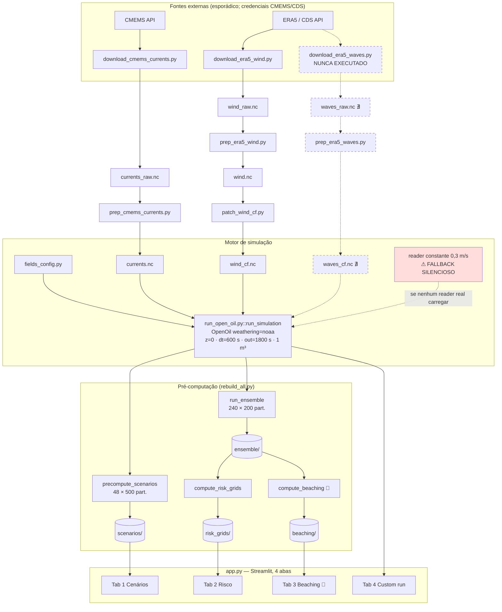

# ARQUITETURA — fluxo de dados fim-a-fim

> Reconstruído por leitura de todas as chamadas + verificação empírica (auditoria 2026-07-29).

## Diagrama geral

## Onde o fluxo se interrompe

1. **Cadeia de ondas** — `download_era5_waves.py` + `prep_era5_waves.py` prontos, dado inexistente.
   O Stokes drift do app funciona por parametrização a partir do vento
   (`drift:use_tabularised_stokes_drift`, `run_open_oil.py:229`), nunca por dado real de onda.
2. **Acoplamento por manifest sem check de completude** — `compute_risk_grids.py:111-116` e
   `compute_beaching.py:136-141` enxergam só o que está em `ensemble/manifest.json`. Membro que
   falha não entra no manifest → grid calculado com menos membros **sem erro** (incidente
   documentado em `main/CLAUDE.md:57-66`, ~60% de falhas passageiras). Não existe verificação
   "esperava 10 membros, achei N".
3. **Partículas que cruzam a borda das forçantes** (caixa 3,5°×3,5°) são desativadas como
   `missing_data` (fallback de correntes/vento = `None`): 15,9% do ensemble em 120 h. O fluxo
   físico "termina na parede" — raiz do achado 🔴 #1.

## Dois caminhos concorrentes para a mesma coisa

- `prep_era5_wind.py` + `patch_wind_cf.py`: duas etapas históricas de uma única transformação
  (renomear + atributos CF), com `wind.nc` intermediário órfão de propósito.
- Constantes definidas em múltiplos lugares que precisam coincidir na mão:
  domínio/resolução da grade (`compute_risk_grids.py:39-41`, `compute_beaching.py:46-48`,
  `app.py:33`) e datas de temporada (`precompute_scenarios.py:37-42`, `app.py:36-41`).

## Caminhos nunca percorridos

- Toda a cadeia de ondas (acima).
- `add_smoke_test_reader` (`run_open_oil.py:121-131`) — fallback nunca ativado até hoje
  (felizmente), mas sem guarda que impeça sua ativação silenciosa num batch.
- `outputs/openoil_smoketest.nc` — órfão de um gerador que não existe mais.
- O bloco `if USE_3D and DISABLE_VERTICAL_MIXING` (`run_open_oil.py:218-219`) — inalcançável
  (`USE_3D=False` constante) e, se alcançado, quebraria (chave `processes:vertical_mixing`
  não existe; a real é `drift:vertical_mixing`).

## Decisões de design: intencionais × acidentais

| Decisão | Veredito |
|---|---|
| Ensemble por **datas de início** (não perturbação de física) | **Intencional**, documentada no docstring (`run_ensemble.py:4-5`) |
| Partículas 500/200/1000 por produto | **Intencional** (custo), sem justificativa física registrada |
| Pré-computação + lookup em vez de rodar ao vivo | **Intencional**; ganho medido ~3.000× (0,02 s vs ~59 s) |
| Acoplamento por manifest | **Intencional**, mas sem check de completude (acidental a fragilidade) |
| Mixing vertical ligado | **ACIDENTAL** — o código tenta desligar e falha silenciosamente |
| Weathering a 10 °C | **ACIDENTAL** — fallback default sem reader de SST |
| Derrame de 1 m³ | **ACIDENTAL** — default `seed:m3_per_hour=1` jamais mencionado |
| Espalhamento via `current_uncertainty=0.05`/`wind_uncertainty=0.5` | **ACIDENTAL** — defaults do OpenOil, não documentados no projeto |
